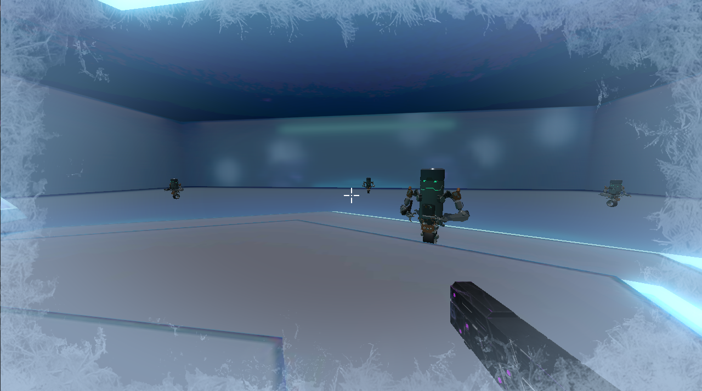
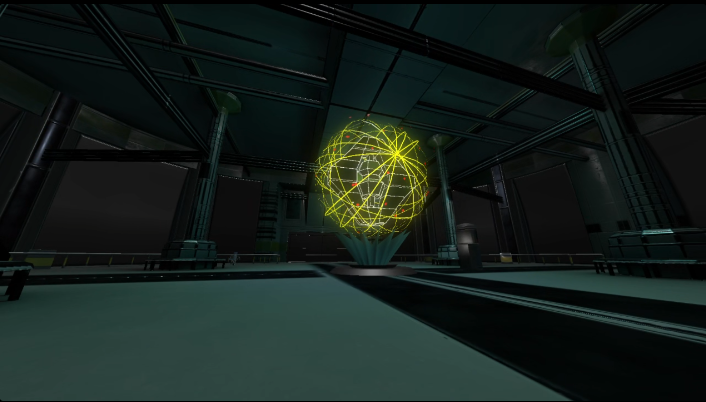
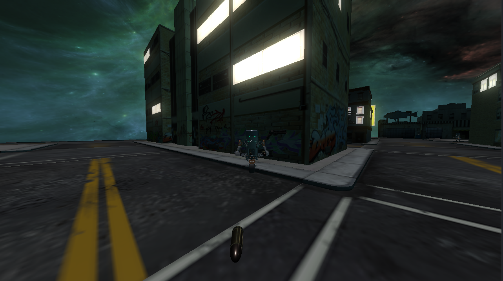

# SUPERCOLD - Phase 2 Report

## Team Information

| Name | ID |
|------|------|
| Marwan Mohammed | 9220808 |
| Youssef Tarek | 9220990 |
| Amir Kedis | 9220166 |
| Moamen Mohammed | 9220886 |

## Project Contributions

### Marwan Mohammed
- **Lighting System**
    - Developed PBR (Physically Based Rendering) materials for realistic surface interactions.
    - Implemented two different types of lighting: Point and Directional lights.
- **Post-Processing Effects**
    - Added bloom.
- **Environment Design**
    - Designed multiple levels and implemented model loading and rendering.

### Youssef Tarek
- **Game Progression System**
    - Designed and implemented the game progression system, including level transitions and player stats.
    - Integrated all game mechanics into the play state.
- **Time Scaling Core Mechanic**
    - Developed the time dilation mechanic, allowing players to slow down time.
    - Implemented the penalty system for using time dilation.
- **Text Rendering**
    - Implemented a text rendering system for displaying game messages.
- **Player HUD**
    - Added crosshair functionality and customizable HUD elements like a pop up for picking up items.

### Amir Kedis
- **FPS Controller**
    - Developed the first-person controller with smooth camera movement and aiming mechanics.
- **Post-Processing Effects**
    - Implemented depth of field and motion blur effects to enhance visual fidelity.
    - Added visual effects for the time dilation mechanic.
- **Animations**
    - Created animations for entities, unfortunately, the animation system was not fully implemented in the final build.

### Moamen Mohammed
- **Physics System**
    - Used Bullet Physics for realistic physics simulation and collision detection.
    - Implemented a custom physics engine for advanced collision callbacks.
- **Audio System**
    - Used OpenAL for 3D audio effects, including spatial sound and environmental audio.
- **Weapon System**
    - Developed a weapon system to handle dropping, picking up, throwing, and shooting weapons.
- **Enemy AI**
    - Created AI behavior for enemies, including state machines for patrolling, chasing, attacking, and searching.

## Screenshots
- **Freeze Time Mechanic**: 
*The freeze time mechanic in action, showing the distinctive visual effect when time slows down during gameplay.*

- **Level Design**: 
*An overview of the level design, showcasing the environment and layout of the game world.*

- **GamePlay and Mechanics**: 
*Gameplay screenshot demonstrating the core mechanics, including player movement, weapon throwing, and enemy interactions.*